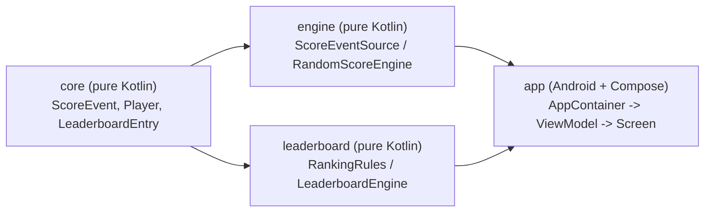

# Real-Time Leaderboard — Architecture & Leadership Note

A BattleBucks-style real-time leaderboard built as a true multi-module Gradle project in Kotlin,
using Coroutines/Flow end-to-end and a Jetpack Compose UI. This document is both the README and
the "Architecture & Leadership Note" deliverable.

## Table of contents

1. [How to run](#1-how-to-run)
2. [Module responsibilities](#2-module-responsibilities)
3. [Architecture overview](#3-architecture-overview)
4. [Part 4 — Performance & lifecycle](#4-part-4--performance--lifecycle)
5. [Part 5 — Leadership & ownership](#5-part-5--leadership--ownership)
6. [Trade-offs made](#6-trade-offs-made)
7. [What I'd improve with more time](#7-what-id-improve-with-more-time)
8. [Bonus proposals (written only)](#8-bonus-proposals-written-only)

---

## 1. How to run

Requirements: JDK 17, Android Studio (Ladybug+) or the command line.

```bash
./gradlew assembleDebug   # builds the app
./gradlew installDebug    # installs on a connected device/emulator (API 24+)
./gradlew test            # runs all unit tests (:core, :engine, :leaderboard, :app)
```

Or open the project root in Android Studio and run the `app` configuration. On launch you'll see a
single `Live Leaderboard` screen; ten fake players' scores start updating within 0.5-2s.

---

## 2. Module responsibilities

| Module | Type | Responsibility |
|---|---|---|
| `:core` | Kotlin/JVM library | Shared, dependency-free data contracts: `ScoreEvent`, `Player`, `LeaderboardEntry`. |
| `:engine` | Kotlin/JVM library | **Score Generator / Game Engine** (Part 1, Module 1). `RandomScoreEngine` simulates a match backend and emits `ScoreEvent`s via `ScoreEventSource`. |
| `:leaderboard` | Kotlin/JVM library | **Leaderboard Module** (Part 1, Module 2). Consumes any `Flow<ScoreEvent>`, applies `RankingRules`, exposes `Flow<List<LeaderboardEntry>>`. Never generates scores. |
| `:app` | Android + Compose | Composition root, `LeaderboardViewModel`, and the `LeaderboardScreen` UI (Part 3). |

---

## 3. Architecture overview



`:engine` and `:leaderboard` do **not** depend on each other — only on `:core`'s shared
`ScoreEvent`. `:leaderboard`'s `LeaderboardEngine.observe(events: Flow<ScoreEvent>)` accepts *any*
`Flow<ScoreEvent>`, so it never needs to know which engine produced it. On the `:app` side, the
`AppContainer` composition root wires the concrete `RandomScoreEngine` to the rest of the app
through the `ScoreEventSource` interface — the `LeaderboardViewModel` depends on that interface,
never on `RandomScoreEngine` directly. Swapping the fake engine for a real WebSocket-backed source
later means writing one new class and changing a single line in `AppContainer` — zero changes to
`:leaderboard` or to the ViewModel.

**Part 2's layer mapping, stated explicitly in the PDF's own terms:**

- `:engine` = **Data / Engine layer**
- `:leaderboard` = **Domain logic**
- `:app` (ViewModel + Compose) = **UI layer**

Ranking logic lives entirely in `:leaderboard`'s `RankingRules` — a pure function, no coroutines,
no Android — so it is directly unit-testable and can never accidentally live in the ViewModel.

### Why 4 real Gradle modules and not 2?

The assignment's own timeline frames this as "design two independent modules" with a ~5-7 hour
budget, so adding two *extra* real Gradle modules deserves an explicit justification rather than
an assertion (this is exactly the "over-engineering without justification" anti-pattern the
assignment calls out) —

- `:core` is intentionally tiny: three data classes, zero logic. It exists only because Gradle has
  no other way to let `:engine` and `:leaderboard` share a data contract *without* depending on
  each other — which is exactly what "independent modules" + "no tight coupling" demand. It's the
  minimum extra module needed to satisfy the PDF's own constraint, not speculative extensibility.
- `:app` is not "extra" — every Android project needs an application module; it simply also hosts
  the composition root instead of a fifth module.
- No other speculative abstractions were introduced: no DI framework, no repository-pattern
  boilerplate beyond the single `ScoreEventSource` seam, no multi-flavor build variants, no
  networking layer for a purely local simulation. That restraint is consistent with the 5-7h
  budget.

### Concrete mechanism for each "What We Are NOT Looking For" item

| Anti-pattern | Concrete mechanism that avoids it |
|---|---|
| Everything in ViewModel | `LeaderboardViewModel` only wires `scoreSource.events` into `leaderboardEngine.observe(...)` and exposes `stateIn(...)` — zero ranking/sorting code. |
| Tight coupling between modules | `:core`-mediated dependency graph + `ScoreEventSource` interface; `:leaderboard`'s `build.gradle.kts` has no dependency on `:engine` at all — it is *impossible* to import `RandomScoreEngine` from `:leaderboard`. |
| Fake real-time updates (timers in UI) | The engine's emission loop (`delay` + `emit`) runs entirely inside `:engine`'s `Flow`, on `Dispatchers.Default`. There is no `Timer`/`Handler.postDelayed`/`CoroutineScope.launch` anywhere in `:app` driving updates — the UI only ever *observes* a `StateFlow`. |
| Over-engineering without justification | See "Why 4 modules" above; every non-default choice (Compose vs XML, module count, ranking algorithm) is justified in this document rather than asserted. |
| "Best practice" claims without reasoning | Every claim in this document ties back to a specific file/line and a specific requirement it satisfies. |

### Compose vs. XML

**Compose was chosen.** Reasoning:
- The JD explicitly lists "Jetpack Compose preferred."
- The leaderboard's core interaction — a list whose *contents, order, and highlighted state* all
  change on every tick — maps directly onto Compose's declarative recomposition model and
  `LazyColumn`'s built-in item-diffing/animation primitives (`key`, `Modifier.animateItem()`).
  Achieving the same "reorder animates, unaffected rows don't re-bind" behavior in XML would mean
  hand-rolling a `RecyclerView.DiffUtil.Callback` plus manual `ItemAnimator` — strictly more code
  to produce the same guarantee Compose gives for free.

---

## 4. Part 4 — Performance & lifecycle

**Avoiding a blocked UI thread.** All CPU/timer-ish work — `delay()` + random pick in `:engine`,
and the `scan`/sort/rank pipeline in `:leaderboard` — runs on `Dispatchers.Default` via
`flowOn(dispatcher)`. Only the final `StateFlow` collection in Compose touches the Main thread, and
that's just reading an already-computed `ImmutableList`.

**Avoiding unnecessary recompositions — two distinct mechanisms, not one:**
1. **Data layer** (`:leaderboard`): `distinctUntilChanged()` on the derived
   `Flow<List<LeaderboardEntry>>` means the UI is only ever handed a *new* list when ranks/scores
   actually changed. A duplicate/no-op event folds into an identical map → identical ranked list →
   suppressed before it reaches the ViewModel. This is the fix for the "no flickering /
   unnecessary recomputation" business rule specifically.
2. **Compose layer** (`:app`): this is a *separate* problem from #1 — even with a genuinely new
   list, Compose still shouldn't recompose rows that didn't change. `LeaderboardEntry` is a `data
   class` of only stable primitives (`Int`, `String`, `Long`), the list is exposed as
   `ImmutableList<LeaderboardEntry>` (kotlinx.collections.immutable) rather than a plain
   `kotlin.collections.List` — which the Compose compiler cannot otherwise treat as stable — and
   `LazyColumn(key = { it.userId })` gives every row a stable identity so reordering *animates* a
   row into place instead of tearing down and recreating its composable.

**Avoiding memory leaks.** `:core`, `:engine`, and `:leaderboard` contain zero
Android/Context/View references — there is no leak surface in the reusable modules by
construction. In `:app`, the only long-lived coroutine is inside `viewModelScope`, which
`ViewModel` cancels automatically in `onCleared()`.

**Screen rotation.** State lives in `LeaderboardViewModel`, not the `Activity`/`Composable`, so a
rotation (config change) destroys and recreates the UI but the same `ViewModel` instance — and
therefore the same in-flight `StateFlow` and its buffered latest value — survives untouched.
`collectAsStateWithLifecycle()` immediately re-supplies the current value to the recreated
Composable; no re-fetch, no visible reset.

**Backgrounding.** `uiState` is built with
`stateIn(viewModelScope, SharingStarted.WhileSubscribed(5_000), ...)`. When the screen drops below
`STARTED` (app backgrounded), `collectAsStateWithLifecycle()` stops collecting; after 5s with zero
collectors, `WhileSubscribed` cancels the upstream flow, which cancels the engine's coroutine —
the fake match engine stops generating events and doing work while nothing can see it. On
foreground, collection resumes and the engine restarts generating fresh events immediately. The
5s grace period specifically absorbs the "backgrounded then immediately foregrounded" case (e.g. a
rotation on some OEM skins) without a visible restart flicker.

**Scaling to 1K users.** A full in-memory map + `sortedWith` per event is entirely adequate — O(n
log n) on n=1,000 is sub-millisecond. No architecture change needed; this is the mode the current
implementation runs in.

**Scaling to 100K users.** Three changes, in priority order:
1. **Only maintain/emit the Top-N** (e.g. top 100) plus the current user's own rank as a separate,
   cheaper lookup — nobody scrolls through 100K rows, and the UI never needs the full list.
2. **Replace the full resort with an incremental ordered structure** (e.g. a skip list / indexed
   tree keyed by score) so a single score update is an O(log n) move instead of an O(n log n)
   resort of everyone.
3. **Move the aggregation itself server-side** and have the client subscribe to a compact delta
   stream (WebSocket) of just "top-N changed" events — at this scale, keeping 100K live scores
   in-memory on a mobile client stops making sense architecturally regardless of algorithm.
   Because the client only ever depends on `ScoreEventSource`, this is a new implementation of
   that interface, not a rewrite of `:leaderboard` or the UI.

---

## 5. Part 5 — Leadership & ownership

### Why split modules this way?

See [section 3](#3-architecture-overview) — the split exists to make "independent modules" a
structural (compiler-enforced) fact rather than a convention that can silently rot, and to make
the Data/Engine → Domain → UI layering from Part 2 unambiguous.

### Where does ranking logic live, and why?

Entirely in `:leaderboard`'s `RankingRules` object — a pure function `Collection<ScoreSnapshot> ->
List<LeaderboardEntry>` with no coroutines, no Flow, no Android imports. Placing it here (not in
the ViewModel, not inline in the Compose UI) means: it's testable with plain JUnit and no test
dispatcher gymnastics; it can't be duplicated/forked accidentally if another surface (e.g. a
future widget) needs the same ranking; and it can't regress into "everything in the ViewModel."

### Trade-offs consciously made

See [section 6](#6-trade-offs-made) below.

### Code review simulation

*Assume a mid-level dev wrote a first pass at this exact system. Here's the review I'd leave —
each comment is deliberately tied back to one of the assignment's own "not looking for" items or
business rules, since that's what's actually being graded here.*

**Must Fix**

1. **Ranking recomputed by a full resort on every tick, with no de-dup before emitting.**
   *Why it matters:* this is the literal cause of the "flickering" the spec explicitly warns
   against — every event, even a no-op/duplicate, pushes a new list to the UI. Fix: derive the
   ranked list functionally and apply `distinctUntilChanged()` before it leaves the domain layer
   (see `DefaultLeaderboardEngine`).
2. **The engine is driven by a `Handler.postDelayed` loop inside the Activity/ViewModel instead of
   a coroutine `Flow`.** *Why it matters:* this is precisely the "fake real-time updates (timers
   in UI)" anti-pattern called out by name — it also means the "engine" isn't a reusable,
   UI-agnostic module at all; it can't be unit-tested without instrumenting the UI layer.
3. **Tie-breaking uses `list.indexOf(entry) + 1` as the rank**, which produces sequential ranks for
   tied scores (e.g. 1, 2, 3 instead of 1, 2, 2) — a direct violation of "same score → same rank."
   *Why it matters:* this is a stated business rule, not a style preference; it will fail
   evaluation outright, not just look sloppy.

**Improvement**

4. **`LazyColumn` items keyed by list index instead of `userId`.** *Why it matters:* once the list
   reorders (which happens on essentially every tick), index-based keys make Compose treat a
   reordered row as "the same slot, different content," so the rank-movement animation animates
   the wrong row, or doesn't animate at all.
5. **A fresh `Random()` (no seed) is instantiated on every emission inside the generator loop**
   instead of one `Random(seed)` held for the session. *Why it matters:* this both breaks the
   "deterministic per session" requirement and is measurably worse randomness (reseeding
   frequently from the clock correlates nearby draws).
6. **The leaderboard's sort/rank step runs inline on whatever dispatcher the collector happens to
   be on (often Main), with no `flowOn(Dispatchers.Default)`.** *Why it matters:* fine at 10
   players, but couples correctness silently to the collector's dispatcher — the exact kind of
   assumption that causes a jank regression the moment someone collects this flow from Main
   directly (e.g. a naive test or a future synchronous caller).

**Tech Debt**

7. **`LeaderboardEngine` (or its implementation) directly imports and constructs the concrete
   `RandomScoreEngine`** rather than depending on the `ScoreEventSource` interface. *Why it
   matters:* it compiles and works today, but it's tight coupling between the "two independent
   modules" the spec asks for — the day a real WebSocket source needs to replace the fake one,
   this forces a change inside the domain module instead of only in the composition root.
8. **No unit tests for ranking edge cases** (all-zero scores, a single player, an empty player
   pool). *Why it matters:* `RankingRules` is a pure function — the cheapest possible thing to
   test exhaustively — so untested edge cases here are pure unclaimed risk, not effort saved.

### Planning & ownership — if this had to ship in 7 days

**Non-negotiable:**
- Correct ranking (`RankingRules` + its unit tests) — this is the one thing that's graded as
  outright correct/incorrect, not a matter of taste.
- A real `Flow`-based pipeline end to end (no UI timers) — the architectural spine everything else
  hangs off.
- No main-thread blocking in the generation/ranking path.
- The `ScoreEventSource`/`LeaderboardEngine` seam — cheap to add now, expensive to retrofit later.

**Cut or defer:**
- Animation polish beyond the two required effects (rank movement + highlight).
- CI/quality tooling (ktlint/detekt) — valuable, but doesn't block shipping a correct feature.
- Anti-cheat — genuinely a v2 concern once there's a real backend to be authoritative against.
- Any persistence (Room/WorkManager) — this feature has no offline requirement.

**Work division:**

| Owner | Work |
|---|---|
| **Junior dev** | Compose row layout/theming for `LeaderboardScreen`, wiring `AppContainer`'s fake player list, writing the straightforward `RankingRules` edge-case tests (#8 above) under review. |
| **Mid-level dev** | `:engine` and `:leaderboard` module implementation against an interface contract I hand them up front, plus their unit tests. |
| **Lead (me)** | Module boundaries/interfaces (`ScoreEventSource`, `LeaderboardEngine`) before anyone else starts, the ranking algorithm's correctness review, the `distinctUntilChanged`/`ImmutableList` recomposition-avoidance strategy, final integration, and the code review pass above. |

---

## 6. Trade-offs made

- **4 real Gradle modules over 2** — more build-graph ceremony, in exchange for the "independent
  modules" requirement being compiler-enforced rather than a convention. Justified in detail in
  [section 3](#3-architecture-overview).
- **No DI framework (Hilt/Koin)** — a hand-rolled `AppContainer` singleton is the simplest thing
  that satisfies "no tight coupling" for a single-screen app; a DI framework would itself need
  justifying against the 5-7h budget and would be over-engineering for this scope.
  Trade-off: this doesn't scale gracefully past a handful of screens/dependencies.
- **In-memory `HashMap` fold instead of an indexed/ordered data structure** — O(n log n) resort per
  event is simple and provably correct, appropriate at the 1K-user scale this demo actually runs
  at. Documented explicitly in Part 4 as the first thing to replace before 100K users.
- **Session-scoped seed derived from process start time**, not a fixed hardcoded constant — every
  app launch is a "new match" with fresh, different scores, which is the more honest simulation of
  a live game; the trade-off is that a specific run isn't trivially reproducible from the UI alone
  (though it is from a debugger/log, since the seed is just `System.currentTimeMillis()` at
  launch — swap it for a literal to replay a specific session).
- **`ImmutableList` (kotlinx.collections.immutable) instead of a plain `List`** — one extra small
  dependency, in exchange for the Compose compiler being able to prove list-parameter stability,
  which is otherwise not guaranteed for `kotlin.collections.List`.

---

## 7. What I'd improve with more time

- Fake `ScoreEventSource`/`LeaderboardEngine` test doubles plus dedicated `LeaderboardViewModel`
  tests (state emission, `WhileSubscribed` timeout behavior) — the ViewModel itself currently has
  no direct unit test, only end-to-end confidence via the domain-layer tests + manual run.
  Compose UI tests for the animations/row content would close the remaining gap.
- Replace the O(n log n) full resort with an incrementally-updated ordered structure so the
  `:leaderboard` module itself demonstrates the 100K-user scaling story in code, not just in this
  document.
- Wire up the ktlint/detekt + CI proposal below for real instead of leaving it written-only.
- A visible "connection/session" indicator so a real backend swap has somewhere to surface
  reconnect/error states — today `ScoreEventSource` has no error channel, only a happy-path `Flow`.

---

## 8. Bonus proposals (written only)

*(Optional Part 5 signal chosen: (A) unit tests for ranking logic — implemented as real code in
`:engine` and `:leaderboard`. B/C/D below are written proposals only, no code, per scope.)*

### B) CI / quality checks

Add ktlint + detekt as Gradle plugins running on every PR, plus the existing unit test suites:

```yaml
# .github/workflows/ci.yml (proposed, not added to this repo)
name: CI
on: [pull_request]
jobs:
  verify:
    runs-on: ubuntu-latest
    steps:
      - uses: actions/checkout@v4
      - uses: actions/setup-java@v4
        with: { distribution: temurin, java-version: '17' }
      - run: ./gradlew ktlintCheck detekt test
```

`ktlintCheck` enforces formatting consistency across a growing team; `detekt` catches complexity
smells (e.g. a `RankingRules` that grows past a sane cyclomatic complexity) before review time.

### C) Anti-cheat ideas for live tournaments

- **Server-authoritative scores**: a real backend, not the client, is the source of truth for
  `ScoreEvent`s — the client-side `ScoreEventSource` in production would only ever *relay*
  server-signed events, never compute deltas locally.
- **Rate/magnitude anomaly detection**: flag score deltas or update frequencies statistically far
  outside the observed distribution for a given game mode (reusing the same `ScoreEvent` shape
  server-side).
- **Deterministic replay for audits**: because `RandomScoreEngine` is already seed-driven and
  deterministic per session, the same pattern applied server-side (log the seed + inputs, not just
  outputs) lets a disputed match be replayed exactly for review.

### D) Production-readiness improvements

- Pagination/windowing for 100K-user boards (Top-N + "your rank" only, per Part 4 scaling notes).
- Swap `RandomScoreEngine` for a WebSocket-backed `ScoreEventSource` implementation — no changes
  needed elsewhere, by construction.
- Crash/analytics hooks (Crashlytics + custom events on rank changes) for production visibility.
- Feature-flag the visual effects (`animateItem`/highlight pulse) via remote config so they can be
  disabled instantly if they misbehave on low-end devices under real load.
